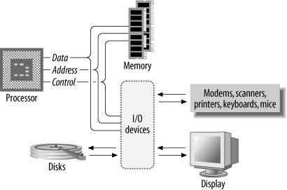

# Welcome to CS0.101 Computer Programming

__Girish Varma__

https://cpro-iiit.github.io/docs/course_material/lectures/1/05_08.pdf

---

<div style="max-width: 640px"><div style="position: relative; padding-bottom: 56.25%; height: 0; overflow: hidden;"><iframe src="https://iiitaphyd-my.sharepoint.com/personal/rc-support_iiit_ac_in/_layouts/15/embed.aspx?UniqueId=d976cf27-af15-4362-b617-5d2dfb7e55ed&embed=%7B%22ust%22%3Atrue%2C%22hv%22%3A%22CopyEmbedCode%22%7D&referrer=StreamWebApp&referrerScenario=EmbedDialog.Create" width="640" height="360" frameborder="0" scrolling="no" allowfullscreen title="Computer Programming _ SH-2 (09.35AM-10.30AM)-20240805_051437-Meeting Recording.mp4" style="border:none; position: absolute; top: 0; left: 0; right: 0; bottom: 0; height: 100%; max-width: 100%;"></iframe></div></div>

---

# Admin Stuff

---

## Teaching Team

Instructors (3): Girish Varma, Abhishek Deshpande, Sandeep Nagar  

TAs (20): Devesh, Sirisetti, Mayaank, Priet, Harshvardhan, Shreya, Annamalai, Talib, Druvitha, Aaditya, Tanishq, Sahil, Karan, Manan, Madhav, Yash, Khooshi, Poorvi, Harshit, Sarthak


---
## How to ace this course?

12 Weeks Course (excluding exam/holiday/prep weeks) ​

| Session          |Time (hrs) |Marks (%)|
|------------------|:---------:|--------:|
| 3 Lectures       |  3 x 1    | -       |
| 1 Tutorial       |  1 x 1    | -       |
| 1 Lab            |  1 x 3    |    2    |
| Reading/Practice |  3        |         |
| Assignment       |  3        | 2.5     |


Total Time per week: 13 hrs  
Total Problem solving per week: 3 (Lab) + 2 (Tut) + 2 (Assgn) 2 (Practice) = 9

---
## Evaluation

| Component        |Marks (%)  |                |
|------------------|:---------:|---------------:|
| Lab              |  10 x 2   | Best 10 of *   |
| Assignments      |   6 x 5   | 6 in No.       |
| Mid Term         |   8 + 12  | Written + Lab  |
| End Sem          |  10 + 20  | Written + Lab  |


80% marks for programming problem solving.  
Solve 100 problems over the entire course.

---
## Websites

Course Website: https://cpro-iiit.github.io/
All lecture/lab/tutorial material is posted. Additional information, links to other courses/tutorials on the web.

Autolab Problem Server: https://pingala.iiit.ac.in/
All lab/assignment/tutorials problems released here. More about this in the lab.

---

# Introduction to Computer Programming

---

## What this Course is about?


- Genie needs to be instructed precisely, otherwise it will not respond!

- It will precisely do, what you told it to do! If you meant something else and that was your problem.

- Genie only understand a language, which has no scope for confusion/ambiguity.

---


---

## Basic Computer Organisation



---


---
## Programming Languages


---


---

# Intro to C Programming

---
## Hello World! C Program
`main.c` file. Try it out at https://www.programiz.com/c-programming/online-compiler/ 
```c
// 1. This line is a comment that is ignored by compiler.

// 2. include standard library for input/output. Allows to print to shell
#include <stdio.h> 

// 3. execution start inside this **function** named main. 
int main() 
{ // start of main function

    // 4. prints to the shell
    printf("Hello, world\n");
    return 0; /* 5. returns integer 0 */

} // end of main function
```

---

## Running the Program

1. Run gcc compiler to get executable file `main`
```gcc main.c -o main```
2. Run the executable `main`
```./main```

---
## What just happened?


---
## Using Makefile to do it together

1. Create a file `Makefile` (one time step)
```make
// Makefile
run: 
    gcc main.c -o main
    ./main
```

2. run `make run`

Next time, after you modify `main.c`, only `make run` needs to be done.

---

## Reading 

Chapter 1 upto Section 1.4,  
Chapter 2 upto Section 2.2
Computer Science: A Structured Programming Approach Using C    
Behrouz A. Forouzan, Richard F. Gilberg


---

# Fundas for doing Programming!

---
## Tresure Hunt/Dumb charades!

- Dont be afraid to make guesses!
- Dont be afraid to try out guesses! 
- Failed guess gives clues. Learn from them!
- You will eventually learn to make more clever guesses.

---


# Thanks
